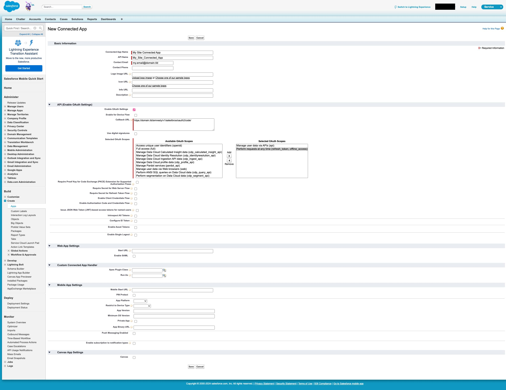

# Configuring the Humanity Salesforce Connector

Activating the plugin will present you with a new "Salesforce Settings" top level menu page in WP Admin.  
Visiting this page will present you with two fields within which you will need to enter a Consumer Key/Secret pair for a Salesforce Connected App.  

You can learn how to create a Connected App via the [Salesforce Documentation](https://developer.salesforce.com/docs/atlas.en-us.api_rest.meta/api_rest/intro_oauth_and_connected_apps.htm).  
When creating your Connected App in Salesforce, you will need to incude the oAuth scopes **api**, and **refresh_token, offline_access**.  
The oAuth callback URL is the URL provided in the information on the Salesforce Settings page in WP Admin.  

Ensure that “Require Secret for Web Server Flow” is **unticked**; this plugin uses the enhanced code verification flow, rather than sending the Consumer Secret in the requests.  



Once you have your Salesforce Connected App set up, you will need to add your Consumer Key and Consumer Secret to the Salesforce settings. Once you have saved these values, you will be prompted to complete oAuth authorisation.  

Clicking the link will redirect you to Salesforce for login, so that the plugin can request authorisation to connect with Salesforce via their REST API.  

Once authorisation has been successfully granted, setup is complete, and the plugin is now able to provide its functionality to its dependents.  

# Using the Salesforce API

Whilst this plugin is designed to provide a Salesforce connection to the [Humanity Donations](https://github.com/amnestywebsite/humanity-donations) and [Humanity Petitions](https://github.com/amnestywebsite/humanity-petitions) plugins (by way of adapters), you can make use of it in your own plugins or theme(s).  

## Making an API Request
The `\Amnesty\Salesforce\Request` singleton class provides RESTful methods for interacting with the Salesforce API.  
This class handles authentication for you, so you only need to create and send requests.  
The request query itself, `q`, is pure Salesforce notation, so Salesforce's documentation should be referenced for query building.  

```php
$request = $wpdb->prepare(
    "SELECT objectFieldName FROM SalesforceApiObjectName WHERE otherObjectFieldName = %s LIMIT %d OFFSET %d",
    'object_field_value',
    10,
    0
);

$response = Request::get( '/query', [ 'q' => rawurlencode( $request ) ] );
$records  = $response['records'] ?? [];
```

Supported request methods:
- `Request::options`
- `Request::head`
- `Request::get`
- `Request::put`
- `Request::post`
- `Request::patch`
- `Request::delete`


## Retrieving a Salesforce Object representation
```php
$object = SObjects::get( 'SalesforceApiObjectName' );
```

### Object Fields
```php
$object        = SObjects::get( 'SalesforceApiObjectName' );
$field_objects = $object->fields();
$field_names   = $object->field_names();

if ( $object->has( 'fieldName' ) ) {
    $field = $object->get( 'fieldName' );
}

```

### Performing Searches
```php
$response = Request::post(
    '/parameterizedSearch',
    [
				'q'        => 'some title',
				'in'       => 'objectTitleFieldName',
				'sobjects' => [ [ 'name' => 'SalesforceApiObjectName' ] ],
				'fields'   => [ 'Id', 'objectTitleFieldName' ],
    ]
);

$records = $response['searchRecords'] ?? [];
```
